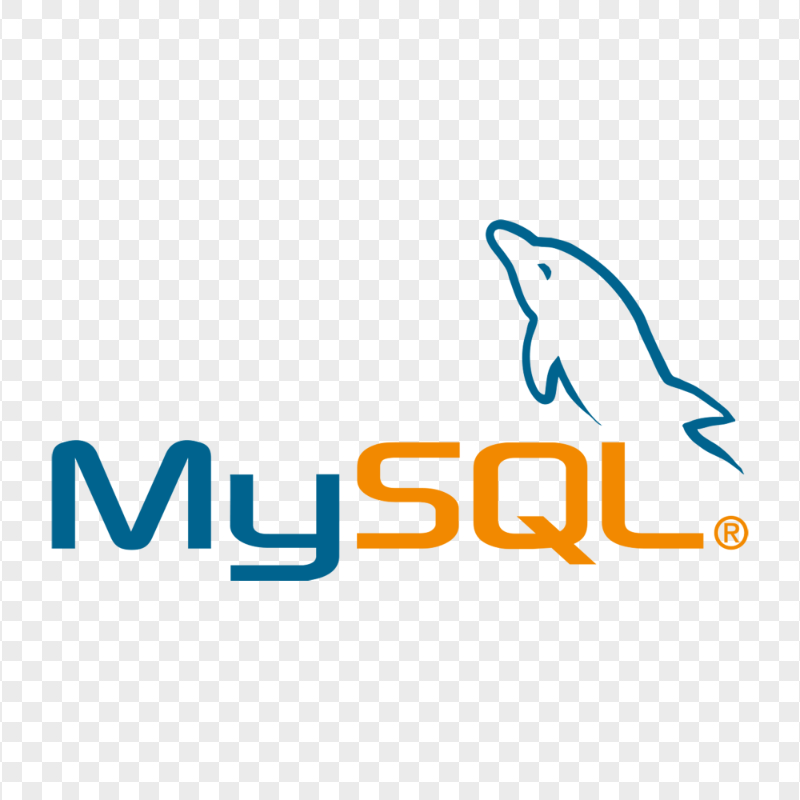

# Nombre de tu Proyecto
# FastAPI Template · 
 

 &nbsp; &nbsp;
 &nbsp; &nbsp;
 &nbsp; &nbsp;
 &nbsp; &nbsp;
 &nbsp; &nbsp;
 &nbsp; &nbsp;

# Clean Architecture Template

What's included in the template?

- Domain layer with sample entities.
- Application layer with abstractions for:
  - Example use cases
  - Cross-cutting concerns (logging, validation)
- Infrastructure layer with:
  - Authentication
  - SQLAlchemy, PostgreSQL (you can change to SQLite for development in database/core.py)
  - Rate limiting on registration
- Testing projects
  - Pytest unit tests
  - Pytest integration tests (e2e tests)

I'm open to hearing your feedback about the template and what you'd like to see in future iterations. DM me on LinkedIn or email me.

--

# Install all dependencies.
- Run `pip install -r requirements-dev.txt`

# How to run app. Using Docker with PostgreSQL.
- Install Docker Desktop
- Run `docker compose up --build`
- Run `docker compose down` to stop all services

# How to run locally without postgres or docker.
- in database/core.py change the DATABASE_URL to sqlite
- run `uvicorn src.main:app --reload`

# How to run tests.
- Run `pytest` to run all tests

Cheers!
